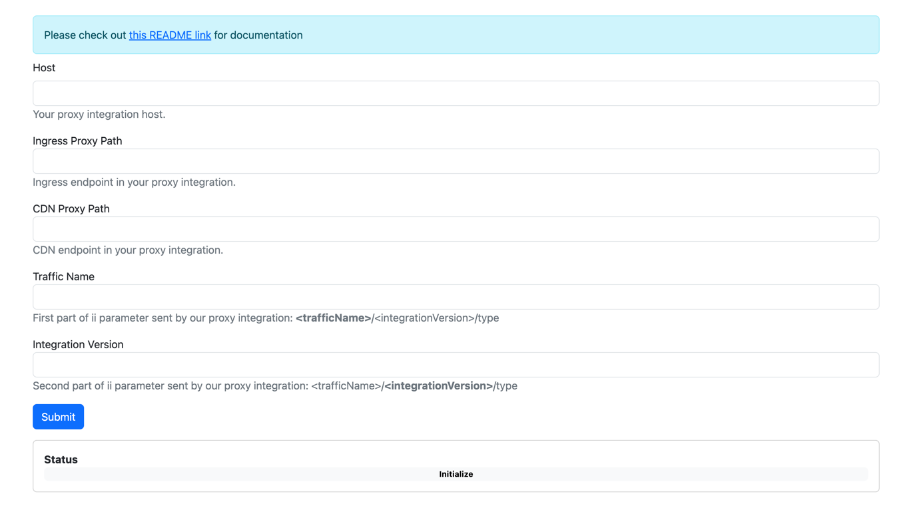

# dx-team-mock-for-proxy-integrations-e2e-tests

> **Note**
> This repository isn’t part of our core product, it's a part of our internal tools.

This repository contains mock server that is used for advanced E2E tests for our proxy integrations.
When the integration is properly configured, it allows us to inspect requests sent from these integrations and perform necessary assertions.


## Preperation

In order to test your proxy integration, you need to configure it to send requests to this mock app.
In most cases, this can be done by setting these two ENV variables when building the integration: `FPCDN` and `INGRESS_API`. For example:

```bash
FPCDN=<API_URL> INGRESS_API=<API_URL> pnpm build
```

You also need to set `secret` as your proxy secret key.

Refer to specific integration README for more details.

> **Note**
> In order to get the API URL, contact the DX team.

## How to use it

### UI

If you navigate to the mock app URL, you will see a simple UI that allows you to run the tests.



### REST API

This app exposes REST API that can be used to run the tests.

To run tests, send `POST` request to: `/api/test/run-tests` with following payload:
```json
{
  // CDN url in your proxy integration
  "cdnProxyUrl": "https://mock-test-inter-568-mock-app-tests.cfi-fingerprint.com/worker/pxdownload",
  // Ingress url in your proxy integration
  "ingressProxyUrl": "https://mock-test-inter-568-mock-app-tests.cfi-fingerprint.com/worker/pxresult",
  // First part of ii parameter sent by our proxy integration: <trafficName>/<integrationVersion>/type
  "trafficName": "fingerprint-pro-akamai",
  // Second part of ii parameter sent by our proxy integration: <trafficName>/<integrationVersion>/type
  "integrationVersion": "1.0.1-snapshot.0"
}
```

You will receive following response:
```json
{
  "host": "https://mock-test-inter-568-mock-app-tests.cfi-fingerprint.com",
  "status": "finished",
  "results": [
    {
      // True if the test passed
      "passed": true,
      // Name of the test
      "testName": "agent request query params",
      // Duration of the request in milliseconds
      "requestDurationMs": 322
    },
    {
      // False if the test failed
      "passed": false,
      // Name of the test
      "testName": "ingress request headers",
      // Duration of the request in milliseconds
      "requestDurationMs": 23,
      // Assertion that failed
      "reason": "customQuery",
      "meta": {
        "error": {
          "generatedMessage": false,
          "code": "ERR_ASSERTION",
          "actual": "123",
          "expected": "1234",
          "operator": "assert"
        },
        // Array of requests that we received from proxy for this test
        "requestsFromProxy": [
          {
            // URL from our app that proxy sent request to
            "url": "<MOCK_APP_HOST>/worker/pxresult",
            // Request headers
            "headers": {},
            // Request method
            "method": "POST"
          }
        ]
      }
    }
  ]
}
```

### CLI

As an alternative, you can use our CLI client:
```bash
npm exec -y "git+https://github.com/fingerprintjs/dx-team-mock-for-proxy-integrations-e2e-tests.git" --
# URL of the mock server 
--api-url="<API_URL>" 
# CDN url in your proxy integration 
--cdn-proxy-url="https://mock-test-inter-568-mock-app-tests.cfi-fingerprint.com/worker/pxdownload" 
# Ingress url in your proxy integration
--ingress-proxy-url="https://mock-test-inter-568-mock-app-tests.cfi-fingerprint.com/worker/pxresult"
# First part of ii parameter sent by our proxy integration: <trafficName>/<integrationVersion>/type
--traffic-name="fingerprint-pro-akamai"
# Second part of ii parameter sent by our proxy integration: <trafficName>/<integrationVersion>/type
--integration-version="1.0.1-snapshot.0"
```

## Adding new tests

Test cases can be found in [src/app/test/cases](src/app/test/cases) directory, and look like this:
```ts
import { assert, assertToBeTruthy } from '../../service/assert'
import { TestCase } from '../../types/testCase'

const testCase: TestCase = {
  // Name of the tests
  name: 'agent request preserve header and query',
  // Test function. It receives `api` object that can be used to send requests to the proxy integration.
  test: async (api) => {
    const query = new URLSearchParams()
    query.set('customQuery', '123')

    // `requestFromProxy` is the request that we received from proxy integration.
    const { requestFromProxy } = await api
      // or .sendRequestToIngress which sends request to the ingress endpoint
      // or .sendRequestToCacheEndpoint which sends request to the cache endpoint
      .sendRequestToCdn(query, { headers: { 'X-Custom': '123' } })
    const { ii, customQuery } = requestFromProxy.query

    assertToBeTruthy(ii)
    assertToBeTruthy(customQuery)

    // More assertions
  },
}

export default testCase
```

To add new test case, simply create new file in [src/app/test/cases](src/app/test/cases) directory with `*.case.ts` file name and provide default export with the `TestCase` object.
It will be automatically picked up by the test runner.

## Running locally

1. Clone the repository.
2. Install dependencies: `npm install`.
3. Run the app: `npm start:dev`. By default the app will run on port `3000`.
4. Use a tunnel to make the app accessible from the internet. For example, you can use [ngrok](https://ngrok.com/):
    ```bash
    ngrok http 3000
    ```
5. Use the URL provided by ngrok to run the tests. Refer to the [Preperation](#preperation) section for more details.
